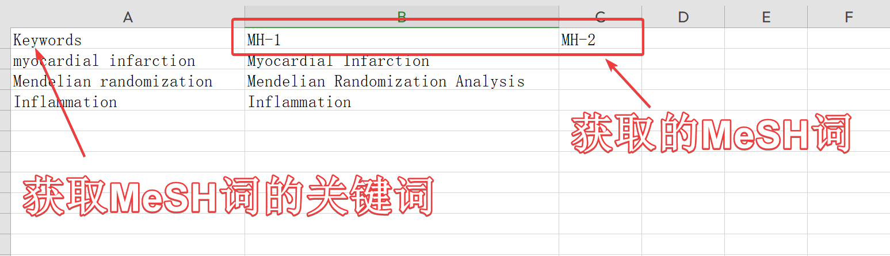

> 🔍 The creation of DXMeSH stems from a deep understanding of the cumbersome process of crafting search terms. Research should not be hindered by repetitive tasks; instead, every minute should be devoted to truly meaningful contemplation. With DXMeSH, comprehensive and accurate search terms can be generated with a single click, unleashing the potential for research and focusing on innovation and discovery.
>
> Hehe, feel free to sprinkle some little stars, and be super happy! 🤩 GitHub URL: `https://github.com/DaXuanGarden/DXMeSH`

## 📈 DXMeSH v1.0

-   **One-Click Search Term Generation**: Build your search strategy quickly with simple commands using PubMed MeSH terms.
-   **Efficient MeSH Searching**: Direct access to the PubMed database, pinpointing medical SCI literature with precise MeSH strategies. \## 🎯 User Guide

## Installation

### GitHub Installation

```         
# 1. Install the devtools package
install.packages("devtools")
# 2. Load the devtools package
library(devtools)
# 3. Install the DXMeSH package
devtools::install_github("DaXuanGarden/DXMeSH")
```

### Local Installation

``` r
library(devtools)
devtools::install_local("/path/to/DXMeSH_1.0.0.tar.gz", dependencies = TRUE, upgrade = FALSE)
```

> If you would like to obtain the package for local installation, leave a message saying 'Da Xuan's DXMeSH', and Da Xuan will send it to you right away! 😊

## Usage

### MeSH Query

[Home - MeSH - NCBI](https://www.ncbi.nlm.nih.gov/mesh)


### Obtain DXMeSH.csv



### Run get_mesh

```         
library(DXMeSH)
get_mesh("DXMeSH.csv")
```

### Successful Execution!

> Now, with just one click, you can obtain comprehensive and accurate PubMed search terms and be redirected to the PubMed webpage. 🎉
>
> 
>
> 

## 🐾 Future Updates

The future updates are eagerly anticipated. We are committed to creating a comprehensive, precise, and efficient medical paper search tool:

1️⃣ **Automated Search and Output**: After generating search terms, perform the search with one click and output structured table files, integrating information such as journal impact factors and title translations.

2️⃣ **Intuitive Term Visualization**: One-click visualization features, including word clouds and bar charts, to display high-frequency terms and research trends vividly.

3️⃣ **AI Literature Summarization**: Future versions will incorporate artificial intelligence technology to automatically summarize literature content, providing intelligent support for researchers.

4️⃣ **Resource Library Construction**: Based on the methodology of the "Scientific Research Theory," create a research material library with one click, aiding in the deepening of medical paper writing and research thought processes.

> `DXMeSH` is inspired by `Professor Zhong's "Scientific Research Theory,"` striving to create a one-stop solution for medical paper search, resource library construction, and term visualization.
>
> 

# 😘 Acknowledgements

1.  Thanks to 'owo' from Guangzhou Medical University for providing the MeSH search term strategy;
2.  Thanks to Professor Zhong for his patient answers on Knowledge Planet and the writing guidance provided by "Scientific Research Theory"

# 📚 References

1.  <https://pubmed.ncbi.nlm.nih.gov/>
2.  <https://www.ncbi.nlm.nih.gov/mesh>
3.  Professor Zhong's "Scientific Research Theory"

## \> Hehe\~ I hope today's sharing was helpful! Feel free to like, save, and share 😁!

# 🎉 Past Highlights

1.  [来玩"Publish or Perish 8"！一站式多数据库SCI检索神器！](https://mp.weixin.qq.com/s/c2QTdHM1oiZO4WKhI4JYwA)

2.  [来玩！FlowUs AI🤖：生信代码注释神器\~](https://mp.weixin.qq.com/s/Cq-qyDWVH3jfCs9GHcfD_A)

3.  [Python+FlowUs：沉浸式的文献阅读体验（上）](https://mp.weixin.qq.com/s/u4ZVW03U9UGvUGSPndnpKw)

4.  [FlowUs：基于"卡片-双链-项目"的数字花园](https://mp.weixin.qq.com/s/TCW87DHmitlt9CVV9-WZaw)

5.  [ChatGPT的拓展玩法：侧边栏聊天+记录保存+快速访问](https://mp.weixin.qq.com/s?__biz=Mzg4NTgyODM0Ng==&mid=2247483842&idx=1&sn=a4daf9b528144d373b0cfb65293ebde9&chksm=cfa3be57f8d4374102533b2ce15c37cd49541d05e887dddbcff53619a289358ad6073334c4df&token=665025671&lang=zh_CN#rd)

6.  [挖呀挖！AutoDock分子对接极简实践方法](https://mp.weixin.qq.com/s?__biz=Mzg4NTgyODM0Ng==&mid=2247483955&idx=1&sn=7b1271f049db4ba8700c0f6c5c4e9d7b&chksm=cfa3bda6f8d434b0c7bf06673d1288048017a09fc6912c175f89cef35dc242d4dc6a7a89b67e&token=1780878932&lang=zh_CN#rd)

7.  [🎉嗯？听说你想要更改服务器/Linux系统中的R版本🐣](https://mp.weixin.qq.com/s?__biz=Mzg4NTgyODM0Ng==&mid=2247484005&idx=1&sn=e4c84edde7a28aec02f90b855e39fe4f&chksm=cfa3bdf0f8d434e664ffe5244cad1953bbd3bda728df843b59705aeab0e0e73f1ae80108649f&token=1780878932&lang=zh_CN#rd)

8.  [单细胞注释，脚步沉重？DXMarkers：多数据库批量检索，一键驾驭Cell Marker！](https://mp.weixin.qq.com/s?__biz=Mzg4NTgyODM0Ng==&mid=2247484096&idx=1&sn=090eab75d405b40e5e6283c77bc2523c&chksm=cfa3bd55f8d434437598488b7d7b7aa1bf8ddab3b0245e5b81675d75233e2fb28064077962fe&token=1600352050&lang=zh_CN#rd)

9.  ["Kingfisher" OR "easyBio"：单细胞转录组原始测序数据下载完全指南](https://mp.weixin.qq.com/s?__biz=Mzg4NTgyODM0Ng==&mid=2247484168&idx=1&sn=c530047f6f7bf6d5e82181c7e5240d3e&chksm=cfa3bc9df8d4358b19d334e040135422d6ca418d7ff671f98d464ea3b01d70bf414da0ed8e12&token=153066669&lang=zh_CN#rd)

10. [实践指南 \| 轻松绘制SCI网络图 - 让Cytoscape成为你的科研利剑！](https://mp.weixin.qq.com/s?__biz=Mzg4NTgyODM0Ng==&mid=2247484181&idx=1&sn=1f6ac7c7d069ce1682136f6546401765&chksm=cfa3bc80f8d435969b5f26caffe0841c3158d54db71e7626e5c7cbe1230ed72066b50e564387&token=153066669&lang=zh_CN#rd)

11. [精读与写作的桥梁：将文献从Zotero搬运至Endnote](https://mp.weixin.qq.com/s?__biz=Mzg4NTgyODM0Ng==&mid=2247484223&idx=1&sn=4495ef5da03a9edf0f419baf397ad323&chksm=cfa3bcaaf8d435bcd41347d72675c46cb89bd1f222235c2f0afed3a40b92791930b1e17f9177&token=359264839&lang=zh_CN#rd)

------------------------------------------------------------------------

> Hello there, welcome to Da Xuan's Growth Garden, where you can find records and reviews of my learning and research journey. As a student of traditional Chinese medicine, I am well aware that I have much to improve and enhance on my path of study and research exploration. Therefore, I am especially eager to communicate more with teachers and classmates to learn and discuss together for greater progress. Da Xuan sincerely invites you to join in the effort, advance together, and witness each other's growth paths. Feel free to email Da Xuan: `daxuan111000@163.com`, so we can share our knowledge, exchange experiences, and grow together.
>
> 

#### Da Xuan Invites You to Experience FlowUs

> `FlowUs`, as a new generation knowledge management and collaboration platform, offers a one-stop work center for individuals and teams, supporting digital information management and collaboration with features like cloud notes, online documents, knowledge bases, and folders.


-   Da Xuan's invitation code: `JG02WW`
-   Da Xuan's invitation link: `https://flowus.cn/login?code=JG02WW`

**If you want to learn more practical methods for FlowUs, leave a message in the public account. Let's discuss and build our own digital gardens together 😊\~**
